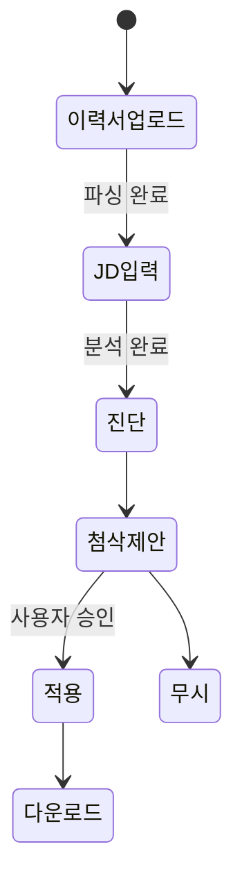
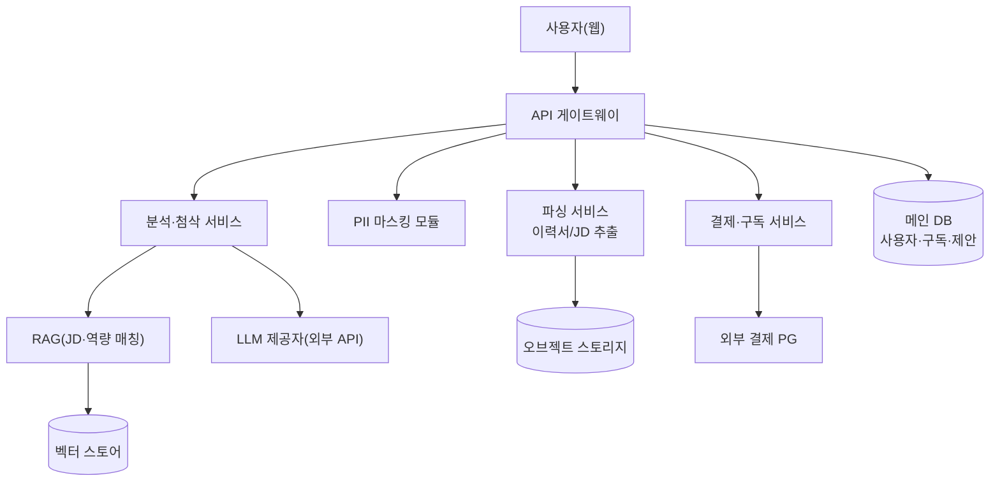
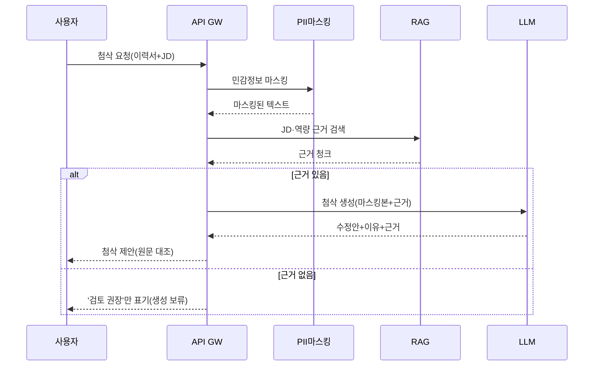

# PNU - 기획서 양식 (예시 모음: AI 이력서 첨삭 서비스)

> 이 문서는 Notion "PNU - 기획서 양식" 데이터베이스에 담긴 4개 예시 문서(PRD · 기능정의서 · ADR · TDD)를 그대로 옮긴 것입니다. 각 섹션 상단의 `▸ 안내`는 해당 항목에 무엇을 써야 하는지에 대한 설명이고, 그 아래가 실제 작성 예시입니다.

---

# 📘 [예시] PRD — AI 이력서 첨삭 서비스

## 문서 정보
| 항목 | 내용 |
|---|---|
| 상태 | Review · v0.9 (베타 출시 전) |
| 작성자 / 오너 | 김지원 (PM) |
| 핵심 팀 | AI/ML · 백엔드 · 프론트 · 디자인 · 그로스 |
| 목표 릴리스 | 2026-Q3 베타, 2026-Q4 정식 |
| 관련 문서 | 기능정의서 · TDD · ADR · 리서치 노트 |

## TL;DR (요약)
> ▸ 안내: 바쁜 이해관계자가 30초에 파악하도록, 무엇을 왜 만들고 성공을 무엇으로 보는지 3~4줄로.

구직자가 이력서와 목표 채용공고(JD)를 올리면, AI가 JD 대비 강약점을 진단하고 **문장 단위 첨삭 제안(근거 포함)**·역량 갭 분석·직무 적합도 점수를 제공한다. 목표는 '혼자서는 막막한 이력서 개선'을 30분 내 실행 가능한 액션으로 바꾸는 것. 성공 지표는 첨삭 반영률과 유료 전환율. 이력서는 민감정보이므로 **PII 보호가 최우선 설계 원칙**이다.

## 1. 배경 & 문제
> ▸ 안내: 왜 이걸 지금 만드는가. 시장 현상 → 근거(데이터/인터뷰) → 해결할 핵심 문제를 좁혀 정의한다. 해결책이 아니라 '문제'를 쓴다.

- **현상**: 구직자 대부분이 '이력서를 어떻게 고쳐야 하는지' 구체적 피드백 없이 지원한다. 유료 첨삭은 비싸고(회당 5~15만원) 느리며(2~5일), 무료 AI 챗봇은 JD 맥락과 근거 없이 일반론만 준다.
- **근거**: 사전 인터뷰 n=25 중 22명이 "무엇을 고쳐야 할지 우선순위를 모른다"고 답함. [확인 필요: 정량 서베이 n≥200로 보강]
- **문제 정의**: 구직자는 *JD에 맞춰 무엇을·왜 고쳐야 하는지*를 즉시, 근거와 함께 알 수단이 없다.

## 2. 목표 & 성공 지표
> ▸ 안내: 되게 할 것(목표)과 그것을 어떻게 측정할지(지표). 모든 지표에 '측정 방법'을 붙이고, 아직 안 잰 목표치는 (미측정)으로 표시해 지어낸 숫자와 구분한다.

**목표**: ① 구직자가 30분 내 실행 가능한 첨삭 액션을 얻는다. ② 첨삭 품질을 신뢰(근거 제시)하게 한다. ③ 지속 사용·유료 전환으로 이어진다.

| 지표 | 측정 방법 | 임계치 |
|---|---|---|
| 첨삭 반영률 | 제안 대비 사용자가 '적용'한 비율(이벤트 로그) | 런칭 40% / 목표 60% (미측정) |
| 근거 정확도(groundedness) | 골든셋 300건, 근거가 이력서·JD로 뒷받침되는지 사람+LLM 검수 | 런칭 90% / 목표 95% (미측정) |
| 무료→유료 전환율 | 가입 코호트 30일 결제 전환(결제 로그) | 런칭 3% / 목표 6% (미측정) |
| 첨삭 유용성(정성) | 완료 후 5점 만족도 설문 | 런칭 4.0/5 (미측정) |

## 3. 비목표 (Non-Goals)
> ▸ 안내: 범위 폭주를 막기 위해 '이번에 하지 않을 것'을 못박는다. 가장 자주 빠뜨리는 항목.

> 🚫 자동 지원·대리 지원 · 채용 담당자용 스크리닝 도구 · 이력서 대필(전면 자동 생성) · 커버레터/포트폴리오 첨삭(1차 범위 외) · 영어 외 다국어(한국어·영어만).

## 4. 대상 사용자 & 사용자 스토리
> ▸ 안내: 누구를 위한 것인지 페르소나로 구체화하고, 그들의 목적을 '~로서 ~하고 싶다'로 표현한다.

| 페르소나 | 상황 | 핵심 니즈 |
|---|---|---|
| 신입 구직자 | 경력 없음, 무엇을 강조할지 모름 | JD에 맞춘 강조 포인트·키워드 |
| 경력 이직자 | 경험 많음, JD별 맞춤화가 번거로움 | 공고별 빠른 맞춤 첨삭 |
| 직무 전환자 | 경력과 목표 직무가 다름 | 전이 가능한 역량 부각·갭 파악 |

- **US-1** 구직자로서, JD를 넣으면 *내 이력서의 약한 문장*을 우선순위로 알고 싶다.
- **US-2** 구직자로서, 첨삭 제안에 *왜 그렇게 고쳐야 하는지 근거*가 붙어 신뢰하고 싶다.
- **US-3** 직무 전환자로서, JD 대비 *부족한 역량/키워드 갭*을 알고 싶다.

## 5. 핵심 사용자 흐름 (User Flow)
> ▸ 안내: 사용자가 가치를 얻기까지의 주요 단계. 상세 화면·예외는 기능정의서로.

이력서 업로드 → JD 입력 → (PII 마스킹) 분석 → 적합도 점수 + 강약점 진단 → 문장별 첨삭 제안(근거) → 사용자가 적용/수정 → 개선본 다운로드 → (무료 한도 초과 시) 구독 유도.

## 6. 기능 요구사항
> ▸ 안내: 필요한 기능 목록과 우선순위. 상세 명세는 기능정의서 참조. P0 필수 / P1 권장 / P2 여유 시.

| ID | 기능 | 우선순위 |
|---|---|---|
| F-1 | 이력서 업로드·파싱(PDF/DOCX/텍스트) | P0 |
| F-2 | JD 등록·요구역량 추출 | P0 |
| F-3 | 직무 적합도 진단·점수 | P0 |
| F-4 | 문장 단위 첨삭 제안(근거 포함) | P0 |
| F-5 | 역량·키워드 갭 분석 | P1 |
| F-6 | 구독·결제(Freemium 한도) | P1 |
| F-7 | 개선 이력·버전 비교 | P2 |

## 7. AI 에이전트 요구사항
> ▸ 안내: 확률적·자율적 AI 기능의 핵심. 일반 PRD가 놓치는 부분으로, AI 서비스라면 반드시 채운다.

- **자율 수준**: 워크플로형(정해진 단계: 파싱→분석→첨삭). LLM이 첨삭 문안을 생성하되 자동 적용은 하지 않고 *제안*만 한다(사용자가 승인).
- **권한 경계**: **항상** 첨삭 시 이력서·JD 근거를 함께 제시 / **승인** 개선본 저장·다운로드 / **금지** 사용자 동의 없는 원문 외부 전송·학습 데이터 사용·경력 사실 날조.
- **가드레일**: 근거 없는 첨삭 금지(이력서에 없는 경력/수치를 지어내지 않음) · 차별적·부적절 표현 필터 · JD 무관 요청 거절 · 저신뢰 시 '검토 권장' 표기.
- **모델 전략**: 역량 기준(한국어·영어 이해, 근거 기반 재작성, 구조화 출력). 구체 모델·서빙은 TDD/ADR에서 결정. [벤치 후 확정]
- **Eval**: 골든셋 300건(이력서-JD-기대첨삭). 지표 = 근거 정확도·유해표현 0·제안 유효율. LLM-judge는 범주형(적절/부적절).
- **비용·지연**: 첨삭 1건 P95 지연 목표·건당 토큰 비용 상한을 둔다(정량치는 벤치 후). [확인 필요]
- **실패 폴백**: LLM 오류·타임아웃 시 재시도 1회 → 실패 시 '잠시 후 재시도' 안내, 부분 결과라도 저장.

## 8. 비기능 요구사항 (NFR)
> ▸ 안내: 기능 외 품질·제약. 이력서 서비스는 개인정보·보안·규정 준수가 특히 중요.

- **개인정보·보안**: 이력서=민감정보. 저장 전 PII 마스킹, 저장 시 암호화, 원문 최소 보존(설계 상세는 TDD/ADR-0002). 개인정보보호법 준수.
- **성능**: 분석·첨삭 결과 체감 지연 관리(정량 목표는 Eval/부하테스트 후). [미측정]
- **접근성**: 웹 WCAG 2.1 AA 지향.
- **가용성**: 정식 출시 기준 99.5% 지향.

## 9. 의존성 & 가정
> ▸ 안내: 성립해야 하는 전제와 외부 의존을 명시해, 무너지면 리스크로 연결한다.

- **의존성**: LLM 제공자(외부 API 가정), 결제 PG, 문서 파싱 라이브러리, 벡터 검색.
- **가정**: 사용자가 텍스트 추출 가능한 이력서를 보유(이미지 스캔본은 인식 저하 → 리스크).

## 10. 리스크 & 완화
> ▸ 안내: 실패 가능성이 큰 지점과 대응책.

> ⚠️
> - LLM 할루시네이션(없는 경력 생성) → 근거 강제·후검증, 자동 적용 금지.
> - 이력서 유출 시 치명적 → PII 마스킹·암호화·접근통제(ADR-0002).
> - 외부 LLM API 비용/정책 리스크 → 사용량 상한·대체 모델 검토(ADR-0001).

## 11. 미해결 질문 (Open Questions)
> ▸ 안내: 아직 결정 못 한 것을 담당·기한과 함께 추적한다.

| 질문 | 담당 | 기한 |
|---|---|---|
| 정량 서베이로 문제 근거 강화 | PM/그로스 | 스프린트 1 |
| Freemium 무료 한도 정책 | PM/그로스 | 스프린트 2 |
| 지연·비용 정량 목표 확정 | AI/백엔드 | 벤치 후 |

## 12. 마일스톤 & 릴리스
> ▸ 안내: 단계별 산출물과 '완료 기준'을 관찰 가능하게.

| 단계 | 산출물 | 완료 기준 |
|---|---|---|
| M1 (핵심) | 파싱 + JD 분석 + 적합도 점수 | 이력서·JD 넣으면 점수·강약점 반환 |
| M2 (첨삭) | 근거 인용 문장 첨삭 + 적용 UX | 제안에 근거 표시, 적용률 로깅 |
| M3 (베타) | 구독·결제 + PII 보안 + Eval 통과 | 수용 기준·보안 점검 통과, 베타 오픈 |

---

# 📗 [예시] 기능 정의서 — AI 이력서 첨삭 서비스

## 문서 정보
| 항목 | 내용 |
|---|---|
| 상태 | Review · v0.9 |
| 작성자 | 박지훈 (백엔드) |
| 관련 문서 | PRD · TDD · ADR |

## 1. 범위 & 용어
> ▸ 안내: 어디까지 만드는지(화면·범위)와 헷갈릴 용어 정의.

- **범위**: 웹 서비스(사용자 화면). 관리자 대시보드는 2차.
- **용어**: JD=채용공고 / 첨삭 제안=문장 단위 수정 권장 / 근거=제안을 뒷받침하는 이력서·JD 근거 / PII=개인식별정보.

## 2. 기능(FR) vs 비기능(NFR)
> ▸ 안내: FR=무엇을 하는가, NFR=얼마나 잘 하는가. 혼동하지 않는다.

| 구분 | 정의 | 예시 |
|---|---|---|
| 기능(FR) | 시스템이 무엇을 하는가 | 이력서를 올리면 JD 대비 강약점을 진단한다 |
| 비기능(NFR) | 얼마나 잘 하는가(품질·제약) | 이력서 원문은 마스킹 후 저장, 외부 전송 없음 |

## 3. 기능 상세
> ▸ 안내: 기능마다 아래 8항목을 표로. **예외(잘못된 입력·실패마다)를 반드시** 채운다.

### F-1 · 이력서 업로드·파싱 (P0)
| 항목 | 내용 |
|---|---|
| 기능 ID / 화면 ID | RES-001 / SCR-UPLOAD |
| 사용자 스토리 | 구직자로서, 이력서를 올려 분석에 쓰고 싶다 |
| 입력 | PDF / DOCX / 붙여넣기 텍스트. 최대 10MB |
| 처리(주 흐름) | ① 형식 판별 → ② 텍스트 추출 → ③ 섹션 구조화(경력·학력·스킬) → ④ PII 마스킹 → ⑤ 저장 |
| 출력 | 구조화된 이력서 미리보기 + 파싱 완료 표시 |
| 예외 | 지원 안 하는 형식 → 안내 / 10MB 초과 → 거절 / 이미지 스캔본(텍스트 없음) → 인식 저하 경고·OCR 안내 / 빈 파일 → 거절 |
| 상태 | 대기 → 파싱중 → 완료 \| 실패 |
| 인수 기준 | Given 텍스트 PDF를, When 업로드하면, Then 경력·학력·스킬 섹션이 구조화되어 표시된다 |

### F-2 · JD 등록·요구역량 추출 (P0)
| 항목 | 내용 |
|---|---|
| 기능 ID / 화면 ID | JD-001 / SCR-JD |
| 사용자 스토리 | 구직자로서, 목표 공고를 넣어 그 기준으로 첨삭받고 싶다 |
| 입력 | JD 텍스트 붙여넣기 또는 URL |
| 처리(주 흐름) | ① 본문 확보 → ② 요구 역량·키워드·우대사항 추출 → ③ 역량 벡터화 |
| 출력 | 추출된 요구 역량·키워드 목록 |
| 예외 | URL 크롤 실패 → 텍스트 직접 입력 안내 / JD가 아닌 텍스트 → 경고 / 너무 짧음 → 재입력 요청 |
| 상태 | 대기 → 분석중 → 완료 \| 실패 |
| 인수 기준 | Given 유효한 JD를, When 등록하면, Then 요구 역량·키워드가 목록으로 추출된다 |

### F-3 · 직무 적합도 진단·점수 (P0)
| 항목 | 내용 |
|---|---|
| 기능 ID / 화면 ID | FIT-001 / SCR-REPORT |
| 사용자 스토리 | 구직자로서, 내 이력서가 이 JD에 얼마나 맞는지 알고 싶다 |
| 입력 | 파싱된 이력서 + 분석된 JD |
| 처리(주 흐름) | ① 요구 역량 대비 이력서 매칭 → ② 적합도 점수 산출 → ③ 강점·약점 근거 정리 |
| 출력 | 적합도 점수(0~100) + 강점 목록 + 약점 목록(각 근거 포함) |
| 예외 | 이력서·JD 중 하나라도 없음 → 진단 불가 안내 / 매칭 근거 부족 → 점수 대신 '데이터 부족' 표기 |
| 상태 | 대기 → 진단중 → 완료 |
| 인수 기준 | Given 이력서와 JD가 준비됐을 때, When 진단하면, Then 적합도 점수와 강약점이 근거와 함께 표시된다 |

### F-4 · 문장 단위 첨삭 제안(근거 포함) (P0)
| 항목 | 내용 |
|---|---|
| 기능 ID / 화면 ID | EDIT-001 / SCR-REPORT |
| 사용자 스토리 | 구직자로서, 어느 문장을 왜 어떻게 고칠지 근거와 함께 받고 싶다 |
| 입력 | 이력서 문장 + JD 근거 |
| 처리(주 흐름) | ① 약한 문장 식별 → ② (근거 있으면) 수정안·이유 생성 → ③ 원문/수정안 대조 제시 |
| 출력 | 문장별 [원문 → 수정 제안 + 이유 + 근거(JD/이력서 위치)], 사용자가 적용/무시 선택 |
| 예외 · 가드레일 | 이력서에 없는 경력·수치를 지어내지 않음 / 근거 없으면 제안 대신 '검토 권장'만 표기 / 차별·부적절 표현은 필터 |
| 상태 | 제안 생성 → 사용자 검토 → 적용 \| 무시 |
| 인수 기준 | Given 근거가 없는 개선점일 때, When 첨삭을 생성하면, Then 사실을 지어내지 않고 '검토 권장'으로만 표기한다 |

### F-5 · 역량·키워드 갭 분석 (P1)
| 항목 | 내용 |
|---|---|
| 기능 ID / 화면 ID | GAP-001 / SCR-REPORT |
| 입력 | JD 요구 역량 + 이력서 역량 |
| 처리(주 흐름) | ① 요구-보유 역량 차집합 → ② 중요도순 정렬 → ③ 보완 방향 제안 |
| 출력 | 부족 역량·키워드 목록 + 보완 팁 |
| 예외 | 이력서에 역량 정보 희박 → '스킬 섹션 보강' 안내 |
| 인수 기준 | Given JD와 이력서가 있을 때, When 갭 분석하면, Then 부족 역량이 중요도순으로 표시된다 |

### F-6 · 구독·결제(Freemium 한도) (P1)
| 항목 | 내용 |
|---|---|
| 기능 ID / 화면 ID | PAY-001 / SCR-BILLING |
| 입력 | 플랜 선택 + 결제 정보(외부 PG) |
| 처리(주 흐름) | ① 무료 한도 확인 → ② 초과 시 결제 유도 → ③ PG 결제 → ④ 구독 상태 갱신 |
| 출력 | 구독 상태·다음 결제일, 한도 잔여 |
| 예외 | 결제 실패 → 재시도 안내 / 중복 결제 방지 / 구독 취소 시 만료일까지 유지 |
| 상태 | 무료 → 결제중 → 구독중 → 만료 \| 취소 |
| 인수 기준 | Given 무료 한도를 초과했을 때, When 결제를 완료하면, Then 즉시 구독 기능이 활성화된다 |

## 4. 상태 전이 (핵심 흐름)
> ▸ 안내: 세션·문서 상태가 바뀌는 흐름을 mermaid로.

## 5. 화면 목록
> ▸ 안내: 주요 화면과 각 화면이 보여주는 것.

- SCR-UPLOAD: 이력서 업로드·파싱 미리보기
- SCR-JD: JD 입력·요구 역량 표시
- SCR-REPORT: 적합도 점수·강약점·문장 첨삭·갭 분석(핵심 화면)
- SCR-BILLING: 구독·결제

## 6. 비기능 요구사항 (요약)
> ▸ 안내: 해당되는 품질 기준만.

| 항목 | 기준 |
|---|---|
| 개인정보 | 저장 전 PII 마스킹, 저장 시 암호화, 원문 최소 보존 |
| 접근성 | WCAG 2.1 AA 지향 |

## 7. 미해결 사항
> ▸ 안내: 아직 안 정한 것 + 대응.

> ❓
> - 이미지 스캔 이력서 OCR 지원 범위 → 대안 검토.
> - JD URL 크롤 허용 도메인 정책 → 확정 필요 [확인 필요].

> 🛠️ 본 문서는 '무엇이 동작해야 하는가'까지만. 모델·라이브러리 선택은 TDD/ADR에서 결정한다.

---

# 📕 [예시] ADR — AI 이력서 첨삭 서비스

> 하나의 중요 기술 결정 = 1개 레코드. 각 ADR은 상태·맥락·결정·대안·결과로 쓴다. (형식: Michael Nygard 표준)

## ADR-0001 · LLM 제공: 외부 API + PII 마스킹 채택
| 항목 | 내용 |
|---|---|
| 상태 | 수락됨 · 2026-07-08 |
| 결정자 | 이현수, 김지원 |

**맥락 (Context)**
첨삭 품질이 서비스의 핵심 경쟁력이며, 초기 소규모 팀이 빠르게 출시해야 한다. 로컬 모델은 품질·운영 부담이 크고, 외부 API는 품질은 좋지만 이력서(민감정보)를 외부로 보내는 리스크가 있다.

**결정 (Decision)**
우리는 외부 LLM API를 사용하되, **전송 전 PII를 마스킹**해 개인식별이 불가한 텍스트만 보낸다.

**고려한 대안 (Considered Options)**
| 대안 | 장점 | 단점 |
|---|---|---|
| 외부 API + 마스킹 (채택) | 최고 품질·빠른 출시 | 마스킹 설계·검증 필요, API 비용 |
| 로컬 모델 | 데이터 외부 유출 0 | 품질 열세·GPU 운영 부담 |

**결과 (Consequences)**
- 좋아지는 것: 출시 속도·첨삭 품질 확보.
- 감수: 마스킹 파이프라인이 필수 경로가 됨(ADR-0002 연결).
- 새 리스크: 외부 API 가격·정책 변동 → 추상화 레이어로 교체 여지 확보.

---

## ADR-0002 · PII 처리: 저장 전 마스킹·암호화, 원문 비영속
| 항목 | 내용 |
|---|---|
| 상태 | 수락됨 · 2026-07-08 |
| 결정자 | 박지훈, 보안 담당 |

**맥락 (Context)**
이력서는 이름·연락처·주소 등 민감정보 덩어리다. 유출 시 치명적이며 개인정보보호법 준수가 필요하다. 동시에 서비스는 외부 LLM과 저장소를 사용한다.

**결정 (Decision)**
우리는 PII를 **저장 전 마스킹하고 저장 시 암호화**하며, 원문 파일은 처리 후 최소 기간만 보존하고 무기한 보관하지 않는다.

**고려한 대안 (Considered Options)**
| 대안 | 장점 | 단점 |
|---|---|---|
| 마스킹+암호화+비영속 (채택) | 유출 리스크 최소·규정 부합 | 구현·검증 비용 |
| 평문 저장 | 구현 간단 | 유출 시 치명·법적 리스크 |

**결과 (Consequences)**
- 좋아지는 것: 사용자 신뢰·규제 리스크 감소.
- 감수: 마스킹으로 일부 맥락 손실 가능 → 품질 영향 모니터링.
- 새 리스크: 마스킹 누락 → 규칙 테스트 필수.

---

## ADR-0003 · JD·역량 매칭: pgvector 채택
| 항목 | 내용 |
|---|---|
| 상태 | 수락됨 · 2026-07-08 |
| 결정자 | 이현수 |

**맥락 (Context)**
JD 요구 역량과 이력서·직무 역량 사전을 의미 검색해야 한다. 초기 데이터량은 크지 않고, 이미 Postgres를 메인 DB로 쓴다.

**결정 (Decision)**
우리는 벡터 검색에 **pgvector**를 사용해 기존 Postgres에 통합한다.

**고려한 대안 (Considered Options)**
| 대안 | 장점 | 단점 |
|---|---|---|
| pgvector (채택) | 기존 DB 통합·운영 단순 | 초대규모 성능은 전용DB보다 약함 |
| 전용 벡터DB | 대규모 성능 | 인프라 추가·운영 부담 |

**결과 (Consequences)**
- 좋아지는 것: 초기 운영 단순·빠른 구축.
- 감수: 대규모 시 성능 한계 가능.
- 되돌리기: 규모 커지면 전용DB 이관 ADR로 대체.

---

## ADR-0004 · 결제: 외부 PG(구독) 채택
| 항목 | 내용 |
|---|---|
| 상태 | 수락됨 · 2026-07-08 |
| 결정자 | 김지원, 백엔드 |

**맥락 (Context)**
Freemium 구독 결제가 필요하며, 카드 정보를 직접 다루면 PCI-DSS 부담이 크다.

**결정 (Decision)**
우리는 **외부 결제 PG의 구독 기능**을 사용하고 카드 정보를 직접 저장하지 않는다.

**고려한 대안 (Considered Options)**
| 대안 | 장점 | 단점 |
|---|---|---|
| 외부 PG (채택) | PCI 부담 이전·빠른 연동 | 수수료·PG 종속성 |
| 자체 구축 | 수수료 절감 | PCI 준수 부담·구축 시간 |

**결과 (Consequences)**
- 좋아지는 것: 보안 부담 이전·빠른 출시.
- 감수: 결제 수수료, 외부 의존.
- 새 리스크: PG 장애 시 결제 중단 → 장애 처리 안내 필요.

---

> 📋 새 결정이 생기면 아래 빈 양식을 복사해 ADR-000N으로 추가하세요.

## ADR-000N · (결정 제목)
> ▸ 안내: "무엇을 무엇으로 정했는지" 한 줄 제목. 번호는 순차.

| 항목 | 내용 |
|---|---|
| 상태 | 제안됨 / 수락됨 / 폐기됨 / 대체됨(→ADR-XXX) |
| 결정자 | |

**맥락 (Context)** — ▸ 안내: 이 결정을 필요하게 만든 상황·문제·제약. 아직 결정은 안 쓴다.

**결정 (Decision)** — ▸ 안내: "우리는 ~한다" 능동태로.

**고려한 대안 (Considered Options)** — ▸ 안내: 대안 | 장점 | 단점 표 2~3개.

**결과 (Consequences)** — ▸ 안내: 좋아지는 것 / 감수할 단점 / 새 리스크.

---

# 📙 [예시] TDD — AI 이력서 첨삭 서비스

## 문서 정보
| 항목 | 내용 |
|---|---|
| 상태 | Review · v0.8 |
| 작성자 / 오너 | 이현수 (아키텍트) |
| 관련 문서 | PRD · 기능정의서 · ADR |
| 최종 수정 | 2026-07-08 |

## 1. 개요 & 범위
> ▸ 안내: 대상 PRD, 이 문서가 다루는 것/안 다루는 것(설계 비목표).

- **대상**: AI 이력서 첨삭 서비스 '레주메이트'.
- **다루는 것**: 아키텍처·데이터 모델·API·AI 파이프라인·PII 보안·배포.
- **안 다루는 것(비목표)**: 다국어, 채용담당자용 기능, 모바일 네이티브 — PRD Non-Goals와 일치.

## 2. 설계 목표 & 제약
> ▸ 안내: 설계가 달성해야 할 목표와 기술·자원·규정 제약.

- **목표**: ① 근거 기반 첨삭(할루시네이션 억제) ② PII 안전(유출 방지) ③ 비용 통제 가능한 LLM 사용량.
- **제약**: 외부 LLM API 의존 · 개인정보보호법 준수 · 초기 소규모 팀.

## 3. 시스템 아키텍처
> ▸ 안내: mermaid flowchart로 컴포넌트 구성도 + 컴포넌트별 책임 표.

| 컴포넌트 | 책임 |
|---|---|
| API 게이트웨이 | 인증·라우팅·율 리미팅·권한 경계 집행 |
| 파싱 서비스 | PDF/DOCX → 텍스트 → 섹션 구조화 |
| PII 마스킹 모듈 | 이름·연락처·주민번호 등 민감정보 탐지·치환(LLM 전달 전) |
| 분석·첨삭 서비스 | 적합도·갭·문장 첨삭 오케스트레이션, 근거 연결 |
| RAG 모듈 | JD·역량 임베딩 검색, 근거 청크 제공 |
| 메인 DB / 오브젝트 / 벡터 | 구조 데이터 / 원본 파일 / 임베딩 |

## 4. 핵심 흐름 (Sequence — 문장 첨삭)
> ▸ 안내: 가장 중요한 시나리오를 mermaid sequence로. PII 마스킹·근거 없음 분기 포함.

## 5. 데이터 모델
> ▸ 안내: 주요 엔티티와 필드. PII·보존 정책을 비고에 명시.

| 엔티티 | 주요 필드 | 비고 |
|---|---|---|
| User | id, 이메일(암호화), 구독상태 | 인증·구독 주체 |
| Resume | id, user_id, 구조화JSON, 원본ref(암호화) | 원본 최소 보존·만료 삭제 |
| JobDescription | id, user_id, 본문, 요구역량[], 임베딩 | 근거 소스 |
| Suggestion | id, resume_id, 원문, 수정안, 이유, 근거ref, 상태 | 적용/무시 추적 |
| Subscription | id, user_id, 플랜, 기간, 결제이력ref | PG 연동 |
| EvalLog | id, 입력ref, 지표, 점수, 시각 | 품질 관측·Eval |

## 6. 인터페이스 / API (초안)
> ▸ 안내: 주요 엔드포인트. 초안 수준.

| 엔드포인트 | 메서드 | 설명 |
|---|---|---|
| /resumes | POST | 이력서 업로드 → 파싱·PII 마스킹 |
| /jds | POST | JD 등록 → 요구 역량 추출 |
| /analyses | POST | 이력서×JD → 적합도·강약점 |
| /suggestions | POST | 문장 첨삭 제안(근거 없으면 보류) |
| /subscriptions | POST | 구독 결제(PG 연동) |

## 7. 기술 스택 & 선택 근거
> ▸ 안내: 레이어별 선택과 근거. 중요 결정은 ADR로 연결.

| 레이어 | 선택 | 주요 대안 | 근거 요약 | ADR |
|---|---|---|---|---|
| LLM | 외부 API + PII 마스킹 | 로컬 모델 | 품질 우선·빠른 출시 | ADR-0001 |
| PII 처리 | 저장 전 마스킹·암호화 | 평문 저장 | 유출 리스크 최소화 | ADR-0002 |
| 벡터 검색 | pgvector | 전용 벡터DB | 기존 Postgres 통합 | ADR-0003 |
| 결제 | 외부 PG(구독) | 자체 구축 | PCI 부담·속도 | ADR-0004 |

## 8. 횡단 관심사
> ▸ 안내: 보안·성능·관측성·확장성을 간략히. 이력서 서비스는 보안이 최우선.

- **보안·PII**: 저장 전 마스킹, 저장 암호화, 접근통제, LLM 전송 전 탈식별화. 원본 만료 삭제.
- **성능**: 파싱·임베딩은 비동기, LLM 응답 스트리밍.
- **관측성**: 첨삭 요청·토큰 비용·근거없음 비율·적용률 로깅 → Eval·비용 관리.
- **확장성**: 분석 서비스 수평 확장, LLM 호출 큐잉.

## 9. AI 파이프라인 설계
> ▸ 안내: RAG 구성·모델 서빙·프롬프트·평가 파이프라인. 구체 수치는 '벤치 후 확정'.

- **RAG**: JD·직무 역량 사전을 임베딩해 검색, 첨삭 시 근거 청크를 프롬프트에 주입.
- **프롬프트**: 시스템 프롬프트에 가드레일(근거 없으면 생성 금지·사실 날조 금지) 명시, 출력은 JSON 스키마.
- **평가**: 골든셋 300건으로 CI에서 오프라인 Eval(근거 정확도·유해성), 온라인은 샘플링 모니터링.

## 10. 대안 & 트레이드오프
> ▸ 안내: 주요 설계 선택의 대안과 맞바꿈.

| 주제 | 택한 것 | 포기한 것 / 트레이드오프 |
|---|---|---|
| LLM | 외부 API | 데이터 외부 전송 → PII 마스킹으로 상쇄 |
| 벡터 검색 | pgvector | 초대규모 성능은 전용DB보다 ↓ (운영 단순함과 맞바꿈) |

## 11. 리스크 & 미해결
> ▸ 안내: 기술적 위험 + 대응/열린 질문.

> ⚠️
> - PII 마스킹 누락 시 유출 → 마스킹 규칙 테스트·이중 검증.
> - 외부 LLM 정책·가격 변동 → 추상화 레이어로 교체 가능성 확보.
> - 근거 검색 품질 저하 → 청크·top-k 튜닝(벤치).

## 12. 배포 & 롤아웃
> ▸ 안내: 배포 형태·파이프라인·단계 롤아웃.

- 컨테이너 기반 배포, CI/CD에 Eval 게이트(기준 미달 시 배포 차단).
- 롤아웃: 내부 도그푸딩 → 베타(초대) → 정식.

## 13. 관련 ADR
> ▸ 안내: 이 설계에서 파생된 주요 결정 목록.

- ADR-0001 LLM 제공: 외부 API + PII 마스킹
- ADR-0002 PII 처리: 저장 전 마스킹·암호화
- ADR-0003 벡터 검색: pgvector
- ADR-0004 결제: 외부 PG
